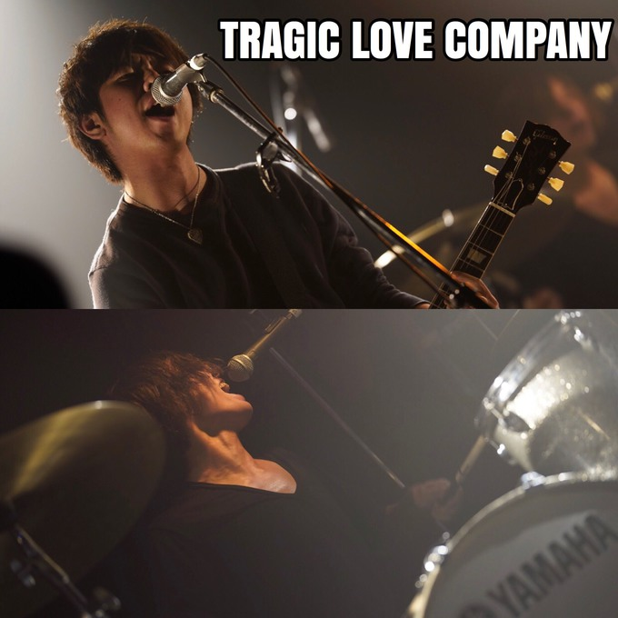

>Kawata

BritPopが特に好きそうだが、それ以外にも古今様々な音楽に詳しい。
最近はレコードにも手を出した模様。
ノリが完全に関西だが、東京進出を目論んでいるとかいないとか。

---favorite--

The Beatles, The Kinks, Stereophonics, Oasis, TRICERATOPS
辺りが好きだと言っていたような気がする。

 

>Takazawa

通称：「チョケ」　しかし、本人はあまりチョケきれていない様子。
「見た目はチャラいが根は真面目」というモテそうなギャップを有しているが、
実際モテているかどうかは本人に聞いて欲しい。

---favorite--

Pearl Jam, My Bloody Valentine, Arcticmonkeys
辺りが好きだと言っていたような気がする。

